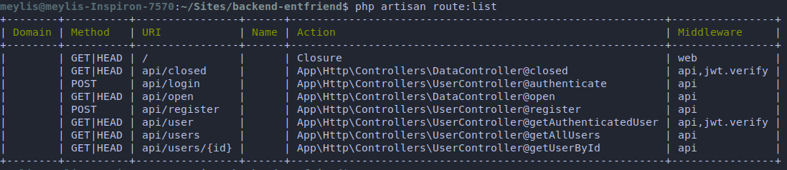

###### Wed Apr  3 09:57:12 IDT 2019

# EntFriend  
Web App for Banking and Taxes Manaement for Belarusian Entrepreneurs and Small Businesses  


## Setup Local Development Environment on MacOS

### Prerequisites  
1. Homebrew – package manager for MacOS  
    https://brew.sh/


### Step by Step Guide  

1. Install required components  
    ```
    brew install php
    brew install composer
    brew install sqlite
    ```

2. Clone this repo  
    ``` bash
    git clone https://github.com/adzsoft/Backend_EntFriend.git
    ```

3. Create new file in the project at path (you may choose your own name for the file)  
    ``` bash
    # run from project's root dir  
    touch database/db_name.sqlite
    ```  

4. Install required PHP packages and finish setup  
    ``` bash
    # run from project's root dir  
    composer install  
    php artisan key:generate  
    php artisan migrate  
    php artisan db:seed  
    composer dump-autoload  
    
    # <OPTIONALLY – if there are no any tables in database>
    php artisan migrate  
    # </OPTIONALLY>
    
    php artisan serve  
    ```

We're done here, congrats!


### Check Setup Works

5. You can now access your project at  
    http://localhost:8000  

6. Test that end-points are configured  
    ``` bash
    php artisan route:list
    ```

    The output should be similar to the one on the picture or table below:  
    

    | Domain | Method   | URI           | Name | Action                                                   | Middleware     |
|--------|----------|---------------|------|----------------------------------------------------------|----------------|
|        | GET|HEAD | /             |      | Closure                                                  | web            |
|        | GET|HEAD | api/closed    |      | App\Http\Controllers\DataController@closed               | api,jwt.verify |
|        | POST     | api/login     |      | App\Http\Controllers\UserController@authenticate         | api            |
|        | GET|HEAD | api/open      |      | App\Http\Controllers\DataController@open                 | api            |
|        | POST     | api/register  |      | App\Http\Controllers\UserController@register             | api            |
|        | GET|HEAD | api/user      |      | App\Http\Controllers\UserController@getAuthenticatedUser | api,jwt.verify |
|        | GET|HEAD | api/users     |      | App\Http\Controllers\UserController@getAllUsers          | api            |
|        | GET|HEAD | api/users/{id |      | App\Http\Controllers\UserController@getUserById          | api            |
